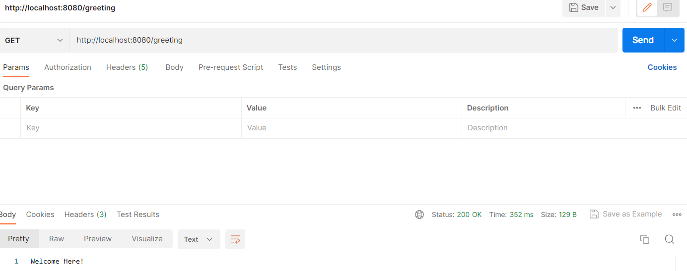

### urls
http://localhost:8080/greeting

### Now Adding JWT Security
### 1.Add Spring Security and JWT dependencies in pom.xml.
### 2. Add jwt.secret=vksjwttokens in application.properties 
### 3.Spring Security and JWT Configuration
### We will be performing 2 operation to configure spring security and to generate JWT and to validate it.
-Generate JWT : Use /authenticate POST endpoint by using username and password to generate a JSON Web Token (JWT).
-Validate JWT : User can use /greeting GET endpoint by using valid JSON Web Token (JWT).

